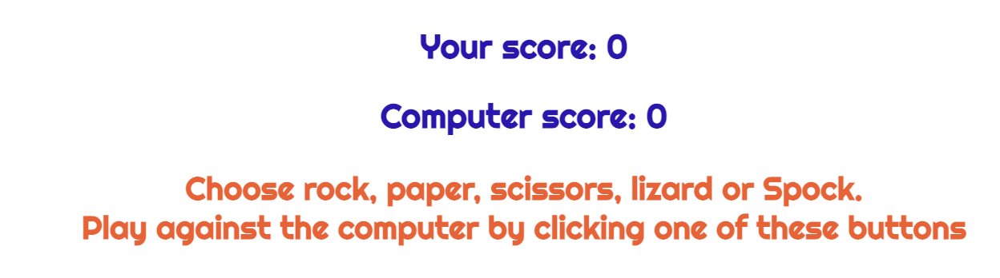
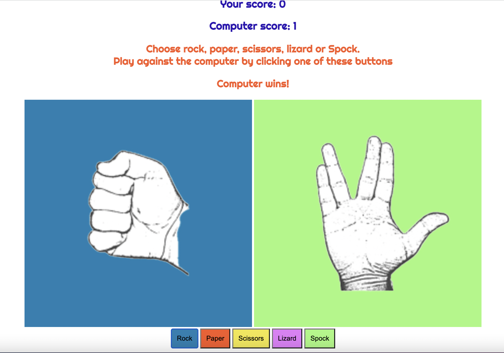
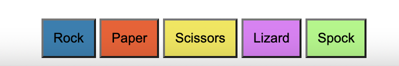
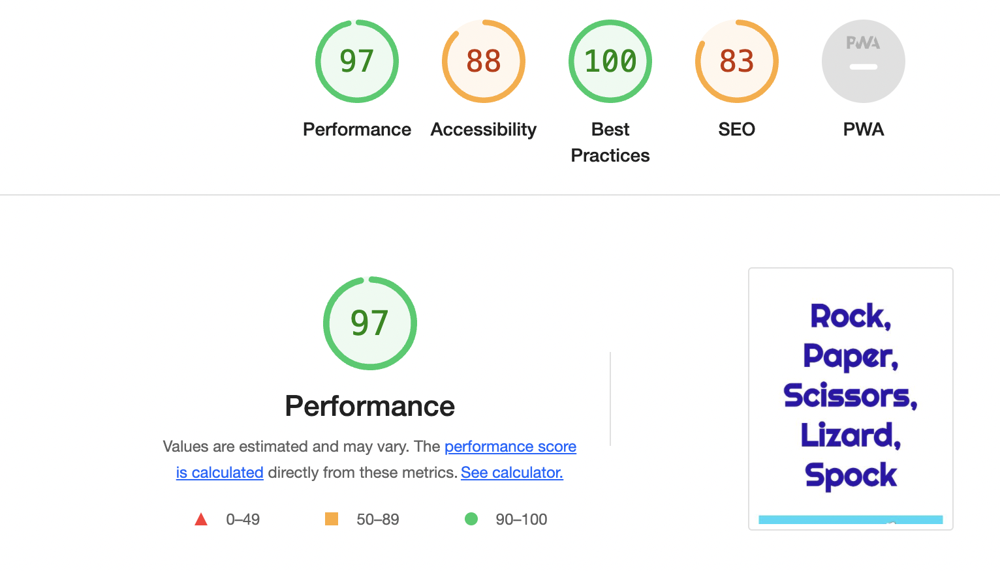

# Little Games - Rock, Paper, Scissors, Lizard, Spock (RPSLS)

RPSLS is part of Little Games' site and is a game of chance that has expanded from the original game - Rock, Paper, Scissors. It is for children and adults alike. Each user plays against the computer, which offers random results. The game plays on an infinite loop and records the scores of the player and the computer and any matches which are a tie.

The game was originally created by Sam Kass with Karen Bryla and first seen on the TV series [The Big Bang Theory](https://bigbangtheory.fandom.com/wiki/Rock,_Paper,_Scissors,_Lizard,_Spock).

I'd like to add more games to the Little Games site.

[View the live project here](https://tenstand.github.io/little-games/).

___

## Features

**Heading**

The header is in a bold, futuristic, easy to read font, which clearly tells the user what the game is. I've added a header image of rock, paper, scissors, lizard, Spock symbols.

**The rules**

The rules of rock, paper, scissors, lizard, Spock are well documented online, so they have been written so the player can easily read and understand them.

**The game area**

The game gives a clear instruction as to what to do. The options are a choice of rock, paper, scissors, lizard, Spock.

**The game results**

When the user clicks on an option, a picture of their choice is shown. The computer choice happens simultaneously, which is chosen at random as a result of the JavaScript code.

The winner is shown by an announcement of "You Win!", Computer wins!" or "It's a tie!". The results are shown above the game so they can be easily tracked. The game is on an infinite loop, so the user can play against the computer for as long as they want.

**game options**

A choice of buttons have been placed in the footer area. They are interactive, which enables the user to click to make their choice. They are brightly coloured, to help make the game look fun and playful.

___

## Testing

- I have tested that the game works in different browsers - Chrome, Safari and Firefox.
- The results are always correct.
- The header, game area, rules and choice options are easy to read and understand.
- I used Dev Tools to make sure the site is responsive for all screens including mobiles and tablets.
- I ran the site through Lighthouse in Dev Tools. I was a little disappointed that the accessibility wasn't 100% but overall, it's quite a positive score.

___

## Bugs

**Unsolved bugs**

The only bug relates to the alt attributes in the index.html on lines 31 & 32, but this will be addressed shortly. All other bugs have been resolved.

___

## Validator testing

**HTML** - Using the W3C validator, errors occurred regarding the game pictures as alt attributes had not been used, this is due to the pictures only being visible when the user clicks an option button.

**CSS** - Using the W3C (Jigsaw) validator no errors were found.

**JS** - Using the JS Hint validator no errors were found.

___

## Deployment

The site was deployed to GitHub Pages, the following steps were taken:

- Locate the GitHub Repository.
- Select settings from the menu.
- Scroll down the settings page to the "GitHub Pages" section.
- Under "source" click the drop-down menu labelled "none" and select "main branch".
- Retrieve the deployed link.

___

## Credits

**Content**

Inspiration for the button layout came from the site [serialized.net](https://serialized.net/app/rpsls/#BITBH).

The rules were taken from [rpsls.net](https://rpsls.net/#55xt9).

**Code**

Some html and css code were taken from the CI Ultimate Rock, Paper, Scissors example project. 

I looked at a number of sites in order to understand JavaScript further. I used the following sites.

- [Stack Overflow](https://stackoverflow.com/)
- [W3Schools](https://www.w3schools.com/)

**Media**

I used the Righteous font from [Google Fonts](https://fonts.google.com/) throughout the site.

Images were taken from [Puzzlewocky](https://puzzlewocky.com/parlor-games/rock-paper-scissors-lizard-spock/).

Photoshop was used to design and resize the images.

Balsamiq was used to create the wireframe during the design process.

___

## Acknowledgements

I'd like to thank my mentor for giving me some excellent tutorial sessions, which helped me understand JavaScript more and for his very helpful feedback.

Code Institute tutor support.