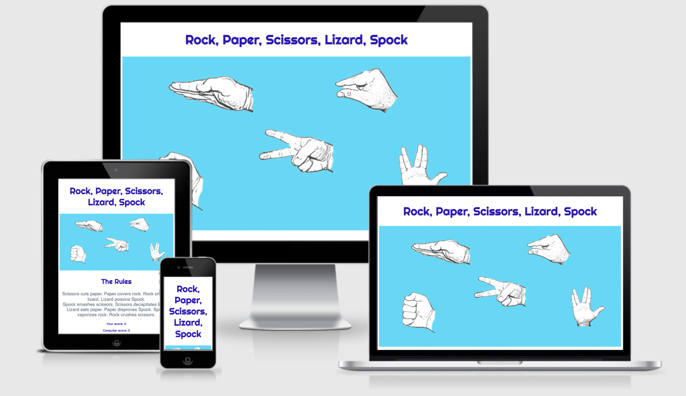
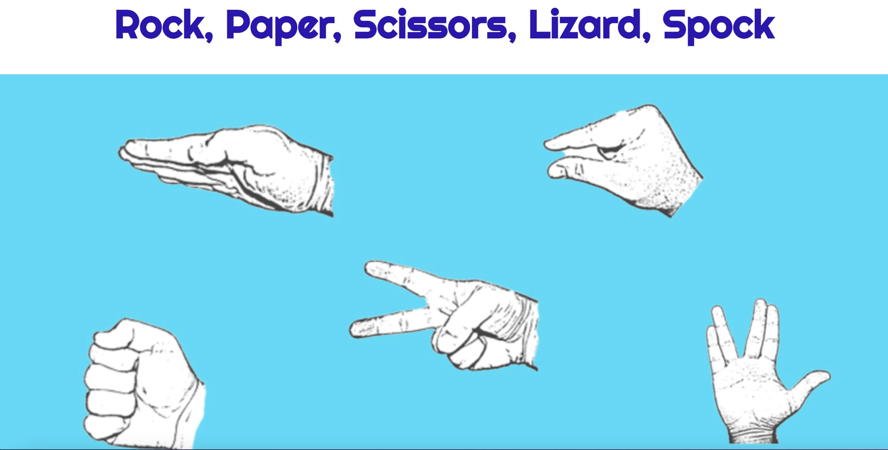
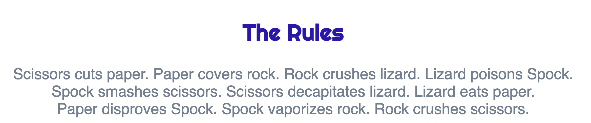

# Little Games - Rock, Paper, Scissors, Lizard, Spock (RPSLS)

RPSLS is part of Little Games' site and is a a game of chance that has expanded fropm the orioginal game Rock, Paper, Scissors. It is for children and adults alike. Each player plays against the computer, which offeres random results. It plays on an infinite loop and records the scores of the player and the computer and any matches which are a tie.

The game was originally created by Sam Kass with Karen Bryla and first seen on the TV series The Big Bang Theory.

## Features

### Heading

This header is in a bold, futuristic, easy to read font, which clesrly tells the user what the game is. I've added a header image of the rock, paper, scissors, lizard, spock symbols.

### The rules

The rules of rock, paer, scissors, lizard, spock are well docunmented online, so they have been written so the player can easily read and understand them.

### The game area

The game gives a clear instruction as to what to do. The options are to choose from rock, paper, scissors, lizard, Spock. The buttons are interactive, so the user can click to make their choice.

### The game results

When the user clicks on an option a picture of what they chose comes up similtaneously to the computer choice, which is chosen at random as a result of the JavaScript code

The winner is shown by an announcenmnet of "You Win" or :Computer wins" or "it's a tie". The results are shown above the game so they can be easily tracked. The game is on a infinite loop, so the user can play against the computer for as long as they want.

### game options

The game options have been placed in the footer area and inlcude brightly coloured buttons, to make the game fun and playful.

## Testing

I have tested that this game works in different browsers - Chrome, Safari and Firefox.
The results are always correct.
The header, game area, rules and choice options are eay to read and understand.
Used Dev Tools to make sure the site is responsive for al screens including mobiles and tablets.
Ran the site through Lighthouse and was a little disappointed the accessibility wasn't 100% but overall it's quite a positive score.

## Bugs

### Unsolved bugs

The only bug relates to the alt attributes in the index.html on lines 31 & 32, but this will be addressed shortly. All other bugs have been resolved.

## Validator testing

HTML - Using the W3C validator it was found alt attributes had not been used, this is dues to the pictures only being visible when the user clicks an option button.

CSS - Using the W3C (Jigsaw) validator no errors were found

JS - Using the JS Hint validator no errors were found

## Deployment

The site was deployed to GitHub Pages, the following steps were taken:

Locate the GitHub Repository.
Select settings from the menu items.
Scroll down the Settings page to the "GitHub Pages" section.
Under "Source" click the drop-down menu labelled "None" and select "main branch".
Retrieve the deployed link.

## Credits

## Media
[Google Fonts](https://fonts.google.com/) was used for the Lato and Oswald fonts throughout the site.

Images used the site were taken from from [Puzzlewocky](https://puzzlewocky.com/parlor-games/rock-paper-scissors-lizard-spock/).

Photoshop was used to design and resize the images.

Balsamiq was used to create the wireframe during the design process.

## Content
The rules were taken from [rpsls.net](https://rpsls.net/#55xt9).

## Acknowledgements

My mentor for giving me some excellent tutorial sessions and his very helpful feedback.

Code Institute tutor support.
